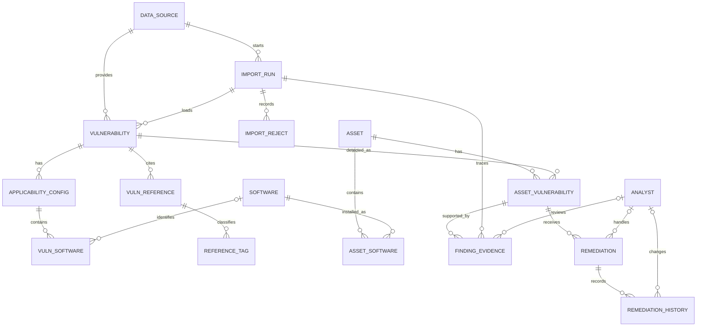

# Entity relationships

```mermaid
erDiagram
    DATA_SOURCE ||--o{ IMPORT_RUN : starts
    DATA_SOURCE ||--o{ VULNERABILITY : provides
    IMPORT_RUN ||--o{ IMPORT_REJECT : records
    IMPORT_RUN ||--o{ VULNERABILITY : loads
    VULNERABILITY ||--o{ APPLICABILITY_CONFIG : has
    APPLICABILITY_CONFIG ||--o{ VULN_SOFTWARE : contains
    SOFTWARE o|--o{ VULN_SOFTWARE : identifies
    VULNERABILITY ||--o{ VULN_REFERENCE : cites
    VULN_REFERENCE ||--o{ REFERENCE_TAG : classifies
    ASSET ||--o{ ASSET_SOFTWARE : contains
    SOFTWARE ||--o{ ASSET_SOFTWARE : installed_as
    ASSET ||--o{ ASSET_VULNERABILITY : has
    VULNERABILITY ||--o{ ASSET_VULNERABILITY : detected_as
    ASSET_VULNERABILITY ||--o{ FINDING_EVIDENCE : supported_by
    IMPORT_RUN ||--o{ FINDING_EVIDENCE : traces
    ANALYST o|--o{ FINDING_EVIDENCE : reviews
    ASSET_VULNERABILITY ||--o{ REMEDIATION : receives
    ANALYST o|--o{ REMEDIATION : handles
    REMEDIATION ||--o{ REMEDIATION_HISTORY : records
    ANALYST o|--o{ REMEDIATION_HISTORY : changes
```
